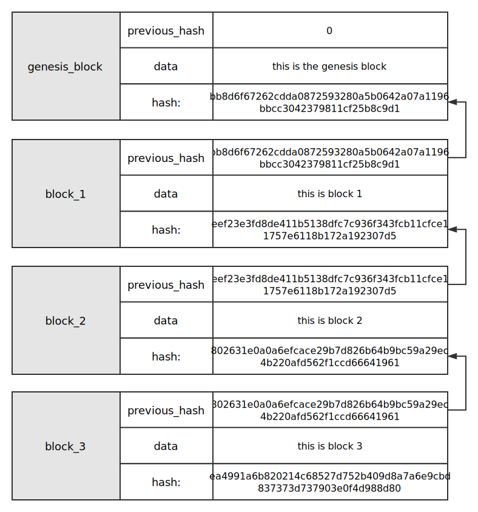
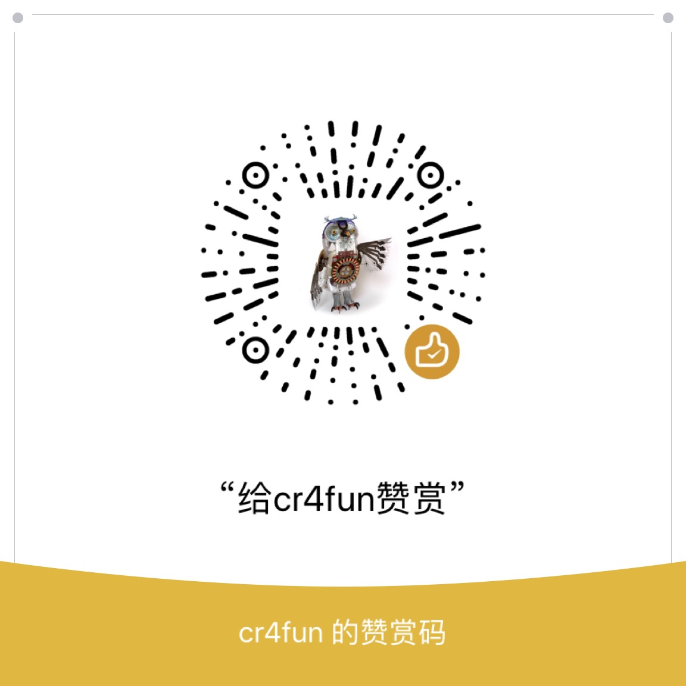
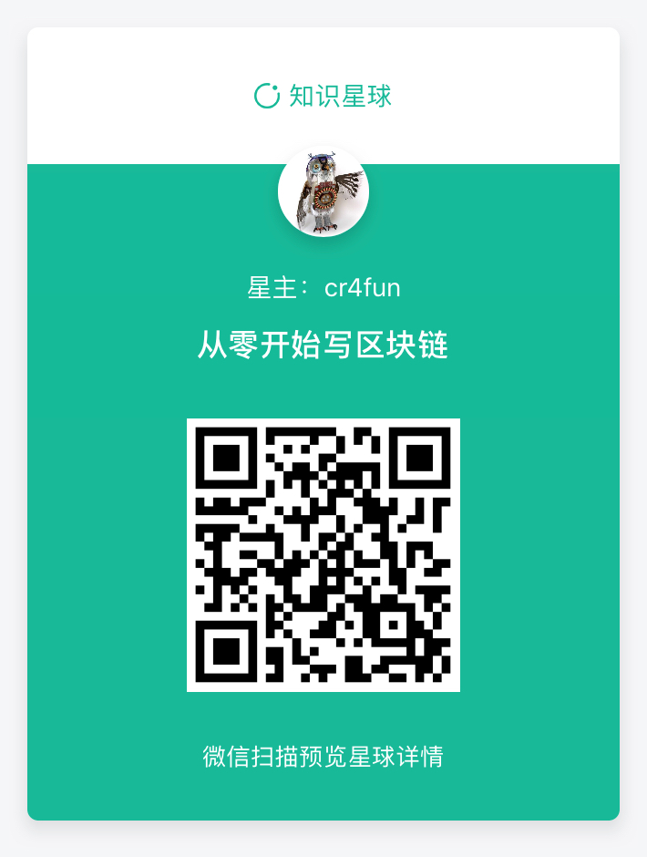

# blockchain 开源教程：从零开始写区块链

### 介绍

这个教程最终完成后，是一个支持物联网设备的专门用于追溯的无币区块链。

目前区块链项目的名字还没有确定，但本教程一旦完成，该项目会立刻启动。

### 说明

> 每个文件夹里都是一个课程，都有源码。

> 本教程目前由我本人来写，因用业余时间，因此不能保证每天都有更新。

> 为了保持简单，本教程用python做示例，大部分只用到 list、dict、json等对象，没有使用class。

> 因水平有限，我尽力把这件事做好，欢迎大家指教。

### 安装

```
https://github.com/OpensourceBooks/blockchain.git
```

```
cd blockchain
```

```
pip3 install -r requirements.txt
```

### 必要环境

* python3
* python3-pip3

### 运行示例

进入每个文件夹，运行:

```
python3 blockchain.py
```

### 简介

区块链是一种由区块组成的链式结构。每个区块有自己唯一的hash值，也有上一个区块的hash值。区块一个一个链接，形成区块链。



如果所示，这是区块链中数据不可篡改的关键。假设把block_1的内容给篡改了，那么block_1的hash就变化了。结果导致block_2的previous_hash和block_1的hash对不上，因此这个区块链就断裂了。


本教程用来说明，如何用python语言来写一个区块链。在我开始写之前，我知道市面上已经有了一些教程，而且也有国外大牛写好了python区块链。但是我依然要写这本书，而且要用开源的方式。至于为什么用python，因为python使用方便，无需配置，而且方便用于各种IOT（物联网）设备上。

### 课程

[第0课、最简单的区块链](0/readme.md)

[第1课、拥有index和时间戳的区块链](1/readme.md)

[第2课、一个能在浏览器访问的区块链](2/readme.md)

[第3课、一个信息上链的功能](3/readme.md)

[第4课、增加一些条件查询的区块链](4/readme.md)

[第5课、可以多节点同步的区块链](5/readme.md)

[第6课、同步节点时进行验证](6/readme.md)

[第7课、签名数据上链](7/readme.md)

[第8课、区块链浏览器](8/readme.md)
    * 8.1 在8的版本上进行了更改，结构更扁平化，为了日后做kv数据的持久化。
[第9课、hash上链](9/readme.md)

> 说明：8.2 文件夹经过测试有问题，不能执行。 8.1 没有测试。8、9、10文件夹内的程序是ok的。

### 赞赏

> 如果我的课程对你有帮助，欢迎赞赏。赞赏的钱将用于出版纸质书籍。

> 赞赏时请备注你的github帐号，我会罗列出来。



### 交流

微信：cr4fun

知识星球


